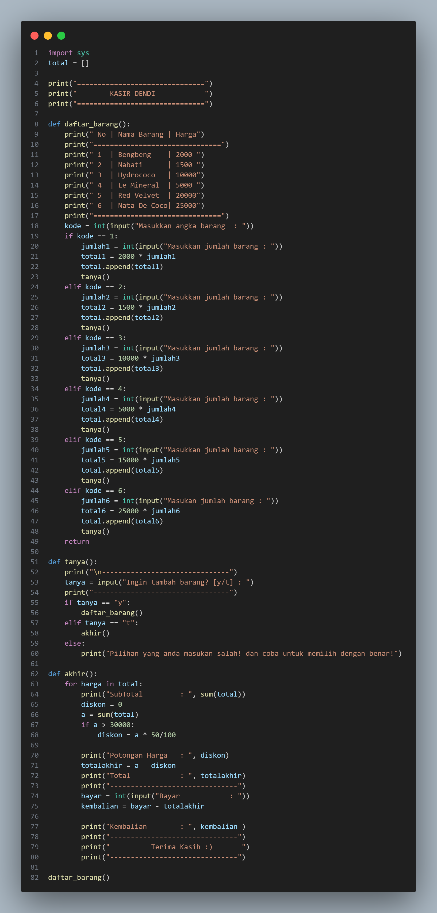
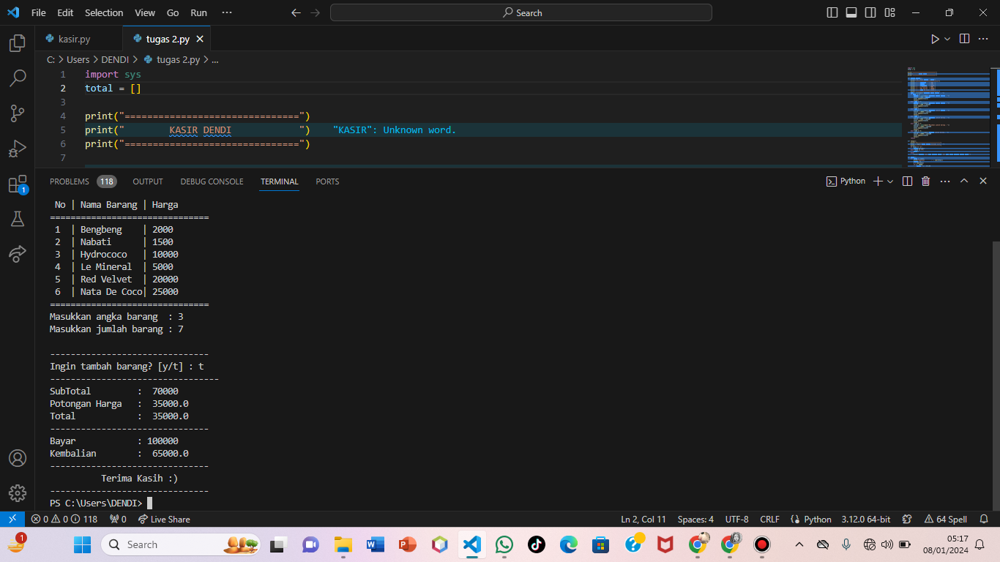

# project-UAS
## UAS

 Buatlah program kasir di sebuah kantin, dengan kondisi berikut:

 List opsi pilihan makanan/minuman dan aksi, bisa menggunakan

format dictionary

 Program harus meminta input pilihan makanan dari pengguna.

 Program harus menghitung total harga makanan yang dipesan.

 Program harus menampilkan struk pembelian.

